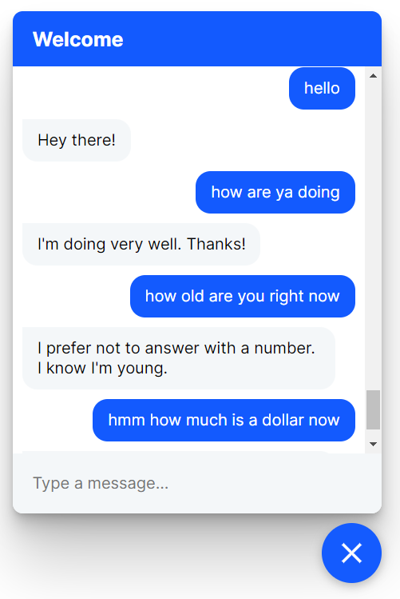
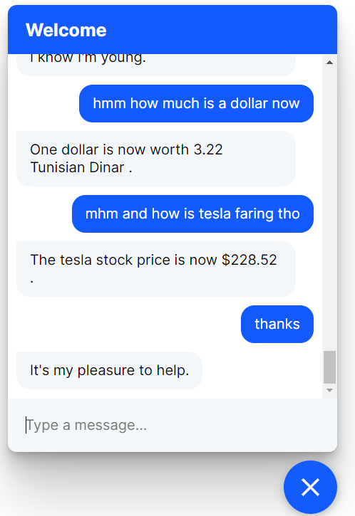
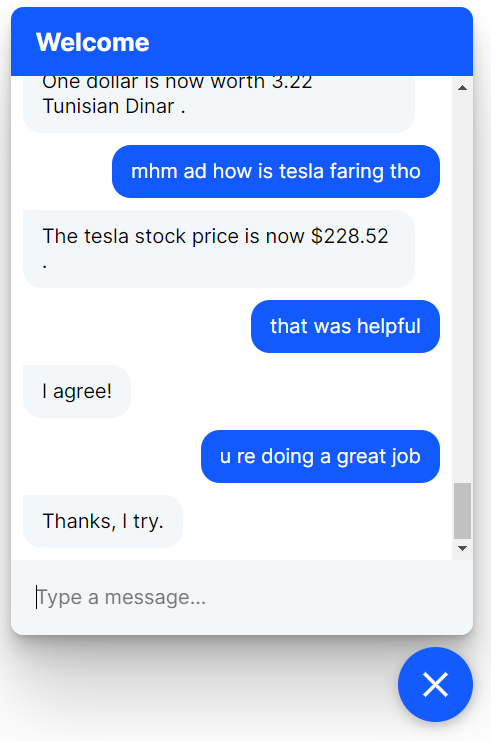

# Financial-chatbot
In today's world, artificial intelligence (AI) is revolutionizing every domain it touches, including natural language processing (NLP) and finance. This project aims to leverage the power of AI to provide users with an agent capable of fluently conversing with them and providing them with real-time financial data whenever needed.

## Training the Model

To train the chatbot model, run the following command:

`rasa train`

This will train the model using the configuration specified in the `config.yml` file and the training data specified in the `data` directory.

## Running the Chatbot with Custom Actions

The Financial Chatbot has custom actions that enable it to scrape the web and provide users with real-time financial data such as currency exchange rates and stock prices.

To use these custom actions, start the action server by running the following command:

`rasa run actions`

This will start the action server on port 5055.

To start the chatbot server, run the following command:

`rasa run`

This will start the chatbot server on port 5005.

## Interacting with the Chatbot

### Using the Rasa Shell

To interact with the chatbot using the Rasa shell, run the following command:

`rasa shell`

This will open up a command-line interface where you can chat with the bot. Try asking it for financial data, such as:

### Using the Web Interface

To interact with the chatbot using the web interface, deploy the chatbot using the following command:

`rasa run --model models --enable-api --cors "*" `

This will start the chatbot server on port 5005 and enable the API.

Next, open the `index.html` file in your web browser. This will load the web interface for the chatbot. Type your message in the text box and press the "Send" button to chat with the bot. Try asking it for financial data, such as:

|  |  |  |
